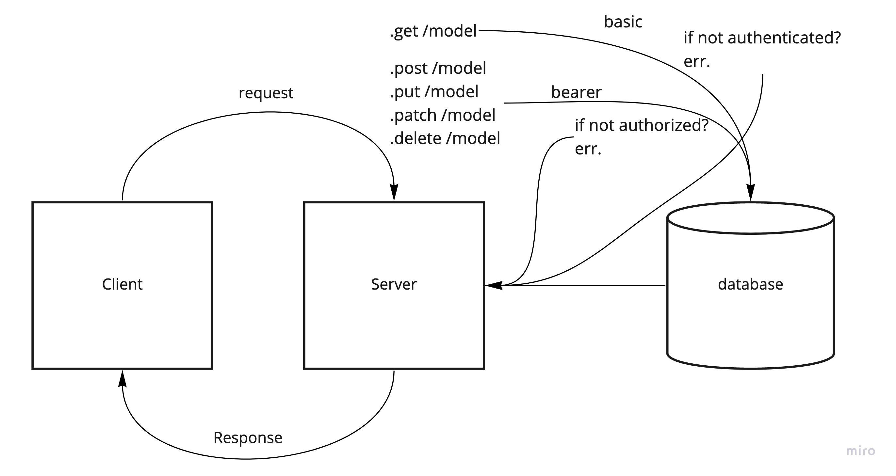

# auth-api

## Current LAB - 08

## Access Control

Being able to login is great. But controlling access at a more granular level is vital to creating a scalable system. In this lab, you will implement Role Based Access Control (RBAC) using an Access Control List (ACL), allowing to not only restrict access to routes for valid users, but also based on the individual permissions we give each user.

### Author: Mark Thanadabouth

### Collaborators: Jeremy B, Lorenzo O, Ayrat G

#### Links and Resources
[Deployed Link](https://mt-authapi-prod.herokuapp.com/)

### Setup

#### `.env` requirements
- `PORT` - \<reference sample.env>
- `DATABASE_URL` - \<reference sample.env>
- `SECRET` - \<reference sample.env>

#### Running App
- `npm start` or `nodemon`

Endpoints:
- .get `/`
> "Access Controll Lab08"
- .post `/signup`
> Post user and password to database
- .post `/signin`
> Post a success if login is valid
- .get `/users`
> Gets all users using token

Models: food and clothes
- .get `/api/v2/<modelName\>`
> User can access
- .post `/api/v2/<modelName\>`
> Writer can access
- .put `/api/v2/<modelName\>`
> Editor can access
- .delete `/api/v2/<modelName\>`
> Admin can access

#### Tests
- `npm test`

### UML

### Reflections and Comments
* Start date (10/21)
* This lab was fun

### LAB - 08

Name of feature: Phase 3

Estimate of time needed to complete: 12 Hours

Start time: 7pm(10/21)

Finish time: 4pm(10/22)

Actual time needed to complete: 5 hours
